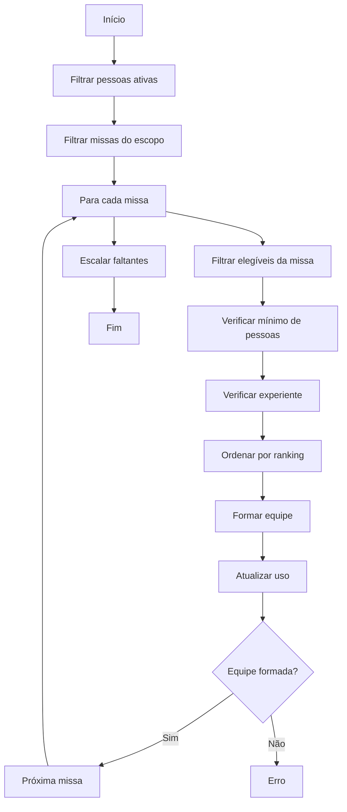

# 📋 Regras de Geração de Escalas

**Documento oficial para revisão e ajustes**

## 1. Princípios Gerais

O motor de geração de escalas (`generate_assignments`) forma equipes para cada missa respeitando simultaneamente:

- Disponibilidade da pessoa
- Escopo selecionado (weekday / weekend / all)
- Prioridades de tipo de servidor
- Experiência
- Fixações (massas ou dias da semana)
- Balanceamento de uso (reduzir repetição)

## 2. Regras de Elegibilidade

A pessoa deve ser **elegível** para a missa se atender **todos** os critérios abaixo:

- `is_active = True`
- `experience` deve estar entre 0 e 3 (incluindo 0 = iniciante)
- Disponibilidade compatível com a data da missa

## 3. Regras de Disponibilidade (`_availability_matches`)

```python
def _availability_matches(person: Person, mass_date: date) -> bool:
```

| Valor de disponibilidade          | Aceita missas de...          |
|-----------------------------------|------------------------------|
| ambos / todo dia / todos           | Qualquer dia                 |
| fim de semana / fds / fs           | Só fim de semana             |
| semana / dia de semana / td       | Só dia de semana             |

## 4. Regras de Escopo (`_scope_matches`)

```python
def _scope_matches(scope: str, mass_date: date) -> bool:
```

- `scope = "all"` → inclui todas as missas
- `scope = "weekday"` → inclui apenas missas de segunda a sexta
- `scope = "weekend"` → inclui apenas missas de sábado e domingo

## 5. Criação da Equipe

Para cada missa (ordenadas por data):

1. **Filtra elegíveis** (ativa + disponível + fixação)
2. **Verifica mínimo** de participantes (padrão = 2)
3. **Verifica presença de experiente** (padrão = experience=3)
4. **Ordena candidatos** usando a função de ranking:
   - Tipo de servidor (prioridade configurável)
   - Fixação (fixo ou não)
   - Uso anterior (balanceamento)
   - Experiência (prioridade configurável)
   - Nome para exibição

## 6. Prioridades Configuráveis

### `ScheduleParameters`

- `participants_per_scale` → padrão 2
- `priority_server_types` → ordem de preferência (ex: `("coroinha", "acolito")`)
- `priority_experience` → ordem de prioridade (ex: `(3, 2, 1, 0)`)
- `participants_by_server_type` → dict de quantidades por tipo (ex: `{"coroinha": 2, "acolito": 1}`)

## 7. Regras de Fixação

- **Fixed Schedule**: Pessoa bloqueada em massa específica
- **Fixed Weekdays**: Pessoa bloqueada em dias da semana específicos

## 8. Regras de Balanceamento

- Minimiza repetição do mesmo servidor na mesma missa
- Quando não há experiente suficiente, força entrada de um experiente (mantendo a ordem)
- Quando há experiência 0, adiciona "extras" até completar 3 pessoas
- Tenta escalar pessoas faltando usando o critério mais justo possível

## 9. Restrições e Erros

- Se não for possível formar equipe válida → **raise ValueError**
- Se uma pessoa disponível não puder ser escalada → **raise ValueError**
- Equipe deve ter no mínimo 3 pessoas quando inclui iniciante (experience=0)

## 10. Fluxo Completo de Geração



## 11. Recomendações para Ajustes

| Problema detectado              | Possível ajuste                  |
|--------------------------------|----------------------------------|
| Equipes muito repetitivas      | Aumentar `priority_experience`    |
| Faltam iniciante               | Aumentar `participants_per_scale` |
| Experientes não são usados     | Ajustar ordem de `priority_server_types` |
| Equipes muito pequenas         | Reduzir `participants_per_scale` |
| Pessoas não são escaladas      | Aumentar quantidade de servidores |

---

**Documento gerado em:** `REGRAS_GENERACAO_ESCALA.md`

**Versão:** 1.0
**Data:** 01/09/2026

**Instruções para você:**
1. Leia o documento acima
2. Me diga quais regras você quer **alterar**
3. Posso editar o código ou atualizar este documento imediatamente
